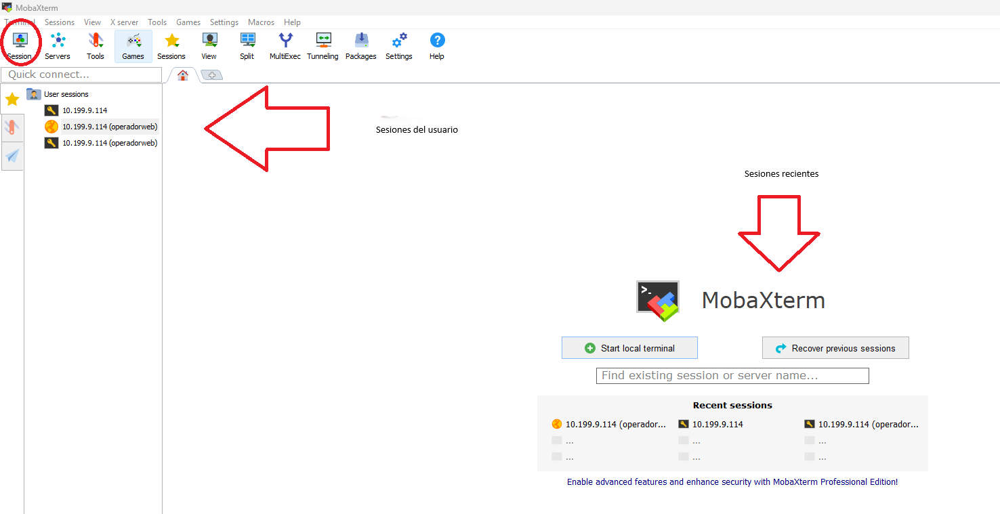
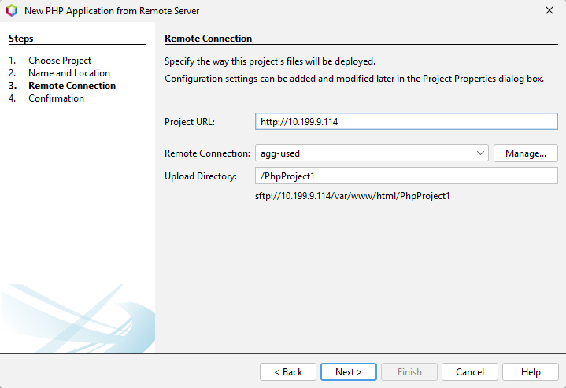
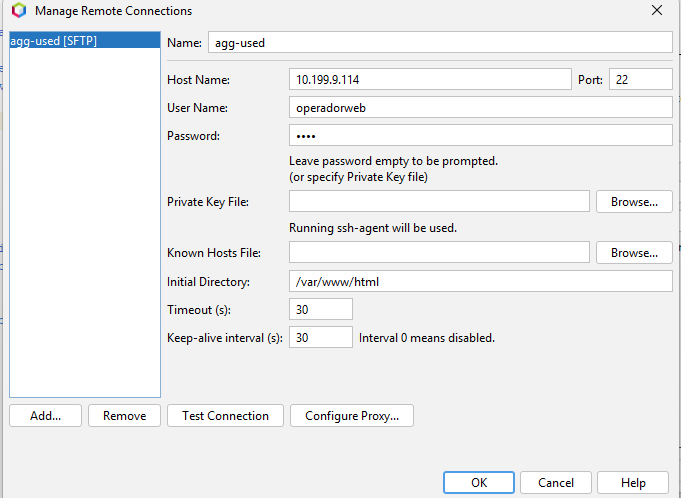

# CFGS Desarrollo de Aplicaciones Web

|  CFGS DESARROLLO  DE APLICACIONES WEB |
|:-----------:|
||
| DESPLIEGUE DE APLCIACIONES WEB
| CYBERSEGURIDAD
| DAWES Tema 2. INSTALACIÓN, CONFIGURACIÓN Y DOCUMENTACIÓN DE ENTORNO DE DESARROLLO Y DEL ENTORNO DE EXPLOTACIÓN |


- [CFGS Desarrollo de Aplicaciones Web](#cfgs-desarrollo-de-aplicaciones-web)
  - [1. Entorno de Desarrollo](#1-entorno-de-desarrollo)
    - [1.1 Ubuntu Server 24.04.3 LTS](#11-ubuntu-server-24043-lts)
      - [1.1.1 **Configuración inicial**](#111-configuración-inicial)
      - [**Instalacion de la maquina**](#instalacion-de-la-maquina)
        - [**Actualizar el sistema**](#actualizar-el-sistema)
        - [Nombre y configuración de red](#nombre-y-configuración-de-red)
        - [**Configuración fecha y hora**](#configuración-fecha-y-hora)
        - [**Cuentas administradoras**](#cuentas-administradoras)
        - [**Habilitar cortafuegos**](#habilitar-cortafuegos)
        - [**Comandos particiones**](#comandos-particiones)
      - [1.1.2 Instalación del servidor web](#112-instalación-del-servidor-web)
        - [**Actualizar el sistema**](#actualizar-el-sistema-1)
        - [Instalación](#instalación)
        - [Verficación del servicio](#verficación-del-servicio)
        - [Virtual Hosts](#virtual-hosts)
        - [Permisos y usuarios](#permisos-y-usuarios)
      - [1.1.3 PHP](#113-php)
      - [1.1.4 MySQL](#114-mysql)
      - [1.1.5 XDebug](#115-xdebug)
      - [1.1.6 Servidor web seguro (HTTPS)](#116-servidor-web-seguro-https)
      - [1.1.7 DNS](#117-dns)
      - [1.1.8 SFTP](#118-sftp)
      - [1.1.9 Apache Tomcat](#119-apache-tomcat)
      - [1.1.10 LDAP](#1110-ldap)
    - [1.2 Windows 11](#12-windows-11)
      - [1.2.1 **Configuración inicial**](#121-configuración-inicial)
        - [**Nombre y configuración de red**](#nombre-y-configuración-de-red-1)
        - [**Cuentas administradoras**](#cuentas-administradoras-1)
      - [1.2.2 **Navegadores**](#122-navegadores)
      - [1.2.3 **FileZilla**](#123-filezilla)
      - [1.2.4 **Netbeans**](#124-netbeans)
      - [1.2.5 **Visual Studio Code**](#125-visual-studio-code)
  - [2. GitHub](#2-github)
  - [3.Entorno de Explotación](#3entorno-de-explotación)
    - [Apache NetBeans IDE22](#apache-netbeans-ide22)
      - [Para crear un nuevo proyecto](#para-crear-un-nuevo-proyecto)

## 1. Entorno de Desarrollo

### 1.1 Ubuntu Server 24.04.3 LTS

Este documento es una guía detallada del proceso de instalación y configuración de un servidor de aplicaciones en Ubuntu Server utilizando Apache, con soporte PHP y MySQL

#### 1.1.1 **Configuración inicial**
#### **Instalacion de la maquina**
Nº de RAM = 2048 MB
Nº de Procesadores = 2
Red = adaptador puente

Cuando nos pregunte como se llamara nuestra cuenta, le decimos que miadmin con contraseña paso

Marcamos la casilla de instalar ssh

Gestion de particiones


##### **Actualizar el sistema**

```bash
sudo apt update
sudo apt upgrade
```

##### Nombre y configuración de red

> **Nombre de la máquina**: XXX-Limpia\
> **Memoria RAM**: 2G\
> **Particiones**: 150G(/) y resto (/var)\
> **Configuración de red interface**: xxxx \
> **Dirección IP** :10.199.9.114/22\
> **GW**: 10.199.8.1/22\
> **DNS**: 10.151.123.21

Debemos marcar la casilla de instalar ssh en la instalación por defecto, pero sino lo hemos hecho
```bash
sudo apt install openssh-server
```
Para comprobar si lo tenemos o no
```bash
sudo systemctl status ssh
```

Comprobamos nuestro nombre
```bash
uname -a
```

Si deseamos cambiarlo 
```bash
sudo hostnamectl set-hostname <NuevoNombre>
sudo nano /etc/hosts
systemctl reboot
```

Comprobamos nuestra IP, nuestra puerta de enlace y los DNS respectivamente.

```bash
ip a
ip r
resolvectl
```
En mi ejemplo, mi IP seria 10.199.9.114

Los otros datos se ven claramente con sus respectivos comandos


Copiamos el fichero de configuración del interface de red  **/etc/netplan/50-xxx.yaml** y hacemos un backup
```bash
cp 50-xxx.yaml 50-xxx.yaml.backup
```
Le cambiamos el nombre al original
```bash
mv 50-xxx.yaml enp0s3.yaml
```

Editar el fichero de configuración del interface de red  **/etc/netplan/enp0s3.yaml**,


```bash

# This is the network config written by 'subiquity'
network:
  ethernets:
    enp0s3:
      addresses:
       - 10.199.9.114/22 (la IP estatica que quieras darle)
      gateway4: 10.199.8.1/22
      nameservers:
         addresses:
         - 10.151.123.21 (Tus DNS)
         - 10.151.126.21
         search: [educa.jcyl.es] (tu dominio)
  version: 2
````

Debemos aplicar los cambios

```bash
sudo netplan apply
```


##### **Configuración fecha y hora**

[Establecer fecha, hora y zona horaria](https://somebooks.es/establecer-la-fecha-hora-y-zona-horaria-en-la-terminal-de-ubuntu-20-04-lts/ "Cambiar fecha y hora")
Para comprobar nuestra fecha y hora
```bash
date
```
Si necesitamos cambiarlo
```bash
timedatectl set-timezone Europe/Madrid
```

##### **Cuentas administradoras**
Root viene por defecto al instalar la máquina
> - [X] root(inicio)
> - [X] miadmin/paso
> - [X] miadmin2/paso

Creacion de miadmin2:
```bash
sudo adduser miadmin2
paso
```
Ahora lo metemos en el grupo de los administradores
```bash
sudo usermod -aG miadmin2
```
Si queremos meterlo en otro grupos, los indicamos despues de -aG
```bash
sudo usermod -aG adm miadmin2
```
Todos los grupos para que miadmin2 tenga los mismo privilegios que miadmin
```bash
adm,cdrom,sudo,dip,plugdev,lxd
```
Comprobamos que lo hemos hecho bien
```bash
cat /etc/passwd | grep miadmin2
```
Comprobamos que lo hemos hecho bien, en el grupo sudo
```bash
cat /etc/group | grep miadmin2
```
Usamos F2 para cambiar a miadmin2 y comprobar que todo este bien o por comando:
```bash
su miadmin2
```
Y para salir de la sesion
```bash
exit
```
Para borrar un usuario
```bash
sudo deluser
```

##### **Habilitar cortafuegos**

Comprobacion del estado del cortafuegos
```bash
sudo ufw status
```
Si es necesario, lo activamos
```bash
sudo ufw enable
```
Si por lo que sea lo queremos desactivar
```bash
sudo ufw disable
```
Ahora abrimos los puertos para permitir ssh
```bash
sudo ufw allow ssh
```
Como hemos abierto el puerto v6, que no nos interesa, sacamos su numero de protocolo:
```bash
sudo ufw status numbered
```
Y lo eliminamos
```bash
sudo ufw delete
```
##### **Comandos particiones**
```bash
lsblk -fm
lsblk -fn
lsblk -a
df -h
fdisk -l
```

#### 1.1.2 Instalación del servidor web
##### **Actualizar el sistema**

```bash
sudo apt update
sudo apt upgrade
```
##### Instalación
Instalamos apache https
```bash
sudo apt install apache2
```
Y abrimos es puerto para el servicio
```bash
sudo ufw allow 80
```
##### Verficación del servicio
En nuestro navegador de confianza, buscamos mediante nuestra IP
```bash
http://IPSERVER
```
Comandos para iniciar/parar y ver el estado
```bash
sudo systemctl start/stop/status apache2
```
En el directorio /var/www/html para ver el dueño
```bash
ls -l
```
Y creamos el usuario operador web
```bash
sudo useradd –M –d /var/www/html -N –g www-data –s /bin/bash operadorweb 
```
Comprobacion (cambiar passwd por group si queremos comprobar el grupo)
```bash
cat /etc/passwd | grep operadorweb 
```
Ahora ponemos la contraseña
```bash
sudo passwd operadorweb
```
Una vez hecho esto, le damos permisos de dueño
```bash
sudo chown –R operadorweb:www-data /var/www/html
```
Y tambien cambiamos los permisos
```bash
sudo chmod -R 775 /var/www/html  
```
En /etc/apache2/site-available/000-default.conf añadimos la siguiente linea
```bash
ErrorLog /var/www/html/error/error.log
```

Tenemos que crear esa carpeta de error ahora

Ahora debemos modificar el fichero apache2.conf que se encuentra en el directorio /etc/apache2, en el apartado
de 'Directory /var/www'.
```bash
AllowOverride All
```


##### Virtual Hosts
##### Permisos y usuarios

#### 1.1.3 PHP
Instalación de PHP
Update y upgrade
Despues de la instalacion de apache, ejecutamos el comando
```bash
sudo apt install php8.3-fpm php8.3
```
Y reiniciamos
```bash
sudo systemctl restart php8.3-fpm
```
Habilitamos el modulo
```bash
sudo a2enmod proxy_fcgi
```
Y también habilitamos esto
```bash
sudo a2enconf php8.3-fpm
```

Podemos comprobarlo con
```bash
grep '^listen' /etc/php/8.3/fpm/pool.d/*.conf
```
O también
Creamos un archivo info.php en /var/www/html con <?php phpinfo(); ?>
Hacemos la comprobacion poniendo en el navegador nuestra dirección de la página/info.php
#### 1.1.4 MySQL
#### 1.1.5 XDebug
#### 1.1.6 Servidor web seguro (HTTPS)
#### 1.1.7 DNS
#### 1.1.8 SFTP
#### 1.1.9 Apache Tomcat
#### 1.1.10 LDAP

### 1.2 Windows 11
#### 1.2.1 **Configuración inicial**
##### **Nombre y configuración de red**
##### **Cuentas administradoras**
#### 1.2.2 **Navegadores**
#### 1.2.3 **MobaXTerm**
##### Conexion al servidor
Página de descarga 
```bash
https://mobaxterm.mobatek.net/download-home-edition.html
```
Para conectarnos a nuestro servidor, en la seccion de "Session"

|

Tanto para la conexion SSH como para la SFTP, solo debemos introducir la IP
del servidor y después el nombre de usuario (a recordar: operadorweb)

#### 1.2.4 **Netbeans**
#### 1.2.5 **Visual Studio Code**
## 2. GitHub
## 3.Entorno de Explotación
### Apache NetBeans IDE22
La página de descarga de nuestro NetBeans, en la version que usamos.
```bash
https://netbeans.apache.org/front/main/download/nb22/
```
#### Para crear un nuevo proyecto 
Es importante tener la carpeta creada con un archivo (aunque esté vacío) en nuestro servidor. Importante que el nombre de la carpeta sea el correcto. También es aconsejable tener la carpeta ya creada en local, sin necesidad de archivos dentro y con el nombre correspondiente.
Cuando creamos un nuevo proyecto elegimos
```bash
PHP application from Remote Server
```
Lo único que cambiamos en la primera pestaña es el nombre del proyecto, escribiendo el adecuado (el mismo que el de las carpetas)
En la siguiente pestaña:

|

En "manage":

|

Si se han realizado los pasos correctamente, ya deberiamos de haber creado nuestro primer proyecto.

# CFGS Desarrollo de Aplicaciones Web
## Medidas de protección básicas
### Autenticación Multifactor (MFA): 
Método de seguridad para identificar a los usuarios, no dependiendo solo de una contraseña. 
Se suele dividir en 3 partes: 1. Algo que el usuario sabe (contraseña), algo que el usuario tiene (teléfono) y 
algo que el usuario es (identificación facial)  

### Roles y permisos: 

### Reglas de firewall:  

### Firewall: Software pensado para impedir el tráfico de una red con otra (se toma en la capa de red, si fuera en la de transporte o la de aplicación es proxy porque mira el paquete) 

### Filtrado de puertos y protocolos: 

### Routers: Poner en contacto una red con otra 

### Monitoreo: 

### Auditoría: 

## Analisis de los incidentes de seguridad
### Ciclo de vida de un incidente:
---

> **Álvaro García González**  
> Curso: 2025/2026  
> 2º Curso CFGS Desarrollo de Aplicaciones Web  

